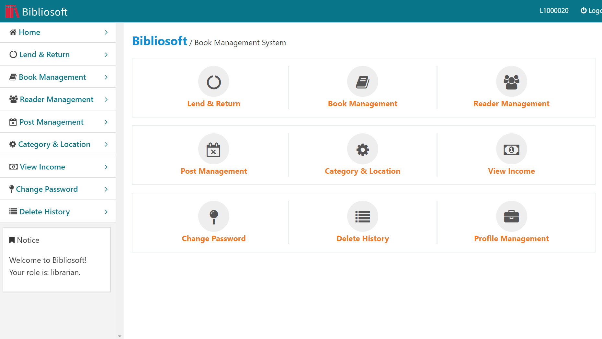
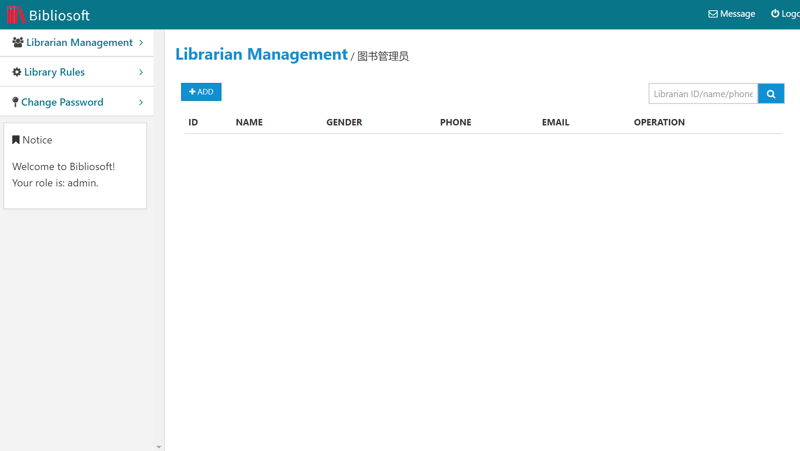

# Web-Project

A book management web project demo named `Bibliosoft`.

## Screen shots

|     |  |
| :--------------------------: | :-----------------------: |
|  |   |

## Prerequisites

- Windows;
- Nginx;
- MongoDB;
- Node.js;
- NPM modules:
  - PM2
  - mongodb;
  - socket.io;
  - request-json;
  - node-schedule;
  - emailjs.

## How to deploy

### Install dependencies

- Visit www.mongodb.com and download and install `mongoDB server`;

- Visit  http://nginx.org/en/download.html and download and install `Nginx`;

- Visit  https://nodejs.org/en/  and download and install `Node.js` (`NPM` will also install automatically);

- Create back-end directory and enter it:

  ```bash
  mkdir bibliosoft
  cd bibliosoft
  ```

  then **copy there all the stuffs in`back_end` directory**.

- Install `PM2` globally:

  ```bash
  npm install pm2 -g
  ```

- Install `mongodb`, `socket.io`, `request-json`, `node-schedule`, `emailjs` locally (**not recommended**):

  ```bash
  npm install --save mongodb socket.io request-json node-schedule emailjs
  ```

  or just install by `package.json` (**recommended**):

  ```bash
  npm install
  ```

### Initialization

- Start `mongoDB` server:

  ```bash
  mongod  --dbpath <your path such as C:\Programs\MongoData> --logpath <your log path such as C:\Programs\MongoData\app.log>
  ```

- Start `mongoDB` client:

  ```bash
  mongo
  ```

  enter the interaction mode and execute following code to create database `Bibliosoft`:

  ```
  use Bibliosoft
  ```

  initialize:

  ```bash
  db.getCollection("accounts").drop()
  db.getCollection("admin").drop()
  db.getCollection("librarian").drop()
  db.getCollection("reader").drop()
  db.getCollection("books").drop()
  db.getCollection("copies").drop()
  db.getCollection("borrows").drop()
  db.getCollection("reserve").drop()
  db.getCollection("session").drop()
  db.getCollection("librarianOperation").drop()
  db.getCollection("income").drop()
  db.getCollection("news").drop()
  db.getCollection("restorePassword").drop()
  db.getCollection("config").drop()
  
  db.createCollection("accounts")
  db.createCollection("admin")
  db.createCollection("librarian")
  db.createCollection("reader")
  db.createCollection("books")
  db.createCollection("copies")
  db.createCollection("borrows")
  db.createCollection("reserve")
  db.createCollection("session")
  db.createCollection("librarianOperation")
  db.createCollection("income")
  db.createCollection("news")
  db.createCollection("restorePassword")
  db.createCollection("config")
  
  db.getCollection("accounts").insert({"username":"admin", "password": "admin", "type": "admin"})
  
  db.getCollection("location").insert({location: "1-01-01"})
  db.getCollection("location").insert({location: "1-01-02"})
  
  db.getCollection("type").insert({type: "Music"});
  db.getCollection("type").insert({type: "Art"});
  db.getCollection("type").insert({type: "Science"});
  
  db.getCollection("globalVar").insert({var_name:"bar_code", "bar_code": 7563287654293});
  db.getCollection("globalVar").insert({var_name:"librarian", "librarian":  1000020});
  
  db.getCollection("config").insert({varname:"config", "security":300, "limit": 30, "exceed": 1, "maxnum": 3, "reserve": 2});
  ```

  then you get a administration user `admin` and password is `admin`!

- Start front-end:

  - Copying all the stuffs from `front-end` to the `html` directory of  `Nginx`;
  - Start `Nginx`.

- Start back-end by entering `bibliosoft` directory and executing following:

  ```bash
  pm2 start app.js
  ```

  or restart:

  ```bash
  pm2 restart app
  ```

  You also can monitor the logs by:

  ```bash
  pm2 logs
  ```

  and flush them by:

  ```bash
  pm2 flush
  ```

## Test

Open your browser and enter 

http://localhost/admin_login/admin_login.html 

to test `admin` login and enter

 http://localhost/reader_login/login.html 

to test `librarian` login and enter

 http://localhost/reader/login.html 

to test `reader` login.

## Some tips

- If you cannot connect the socket, update your server's firewall rule;